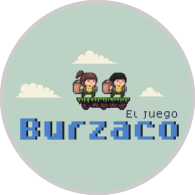

<!-- PROJECT LOGO -->
 

  <h3 align="center">Marcos Tabuyo</h3>

  

    Hi i'm a frontend learner although i also like to do backend.
     
  

  

    <a href="https://marcostabuyo.github.io/#studies">Studies</a>
    ·
    <a href="https://marcostabuyo.github.io/#courses">Courses</a>
    ·
    <a href="https://marcostabuyo.github.io/#lenguages--frameworks">Lenguages & frameworks</a>
      ·
    <a href="https://marcostabuyo.github.io/#webs">Web's</a>
        ·
    <a href="https://marcostabuyo.github.io/#game">Game</a>
      ·
    <a href="https://marcostabuyo.github.io/#contact">Contact</a>
  

<h3>Studies</h3>
<h4>(2015- 2019) <a href="https://uap.edu.ar/carrera/teologia/">River Plate University - Bachelor of Theology</a> 
Score: 9.14/10</h4>

<h3>Courses</h3>
<h4><a href="https://www.educacionit.com/">Education IT</a> - Advanced Web Programmer:</h4>
<ul>
  <li>CSS and DIVs Layout Web positioning</li>
  <li>AJAX: Asynchronous JavaScript and XML</li>
  <li>Web programming in PHP and MySQL</li>
  <li>PHP - Object Oriented Programming</li>
  <li>Java Standard Programming, J2SE 6.0</li>
</ul>
<h4><a href="https://www.udemy.com/course/fullstack-js-en-espanol/">Udemy</a>:</h4>
<ul>
  <li>Full Stack JavaScript Developer en Español (in progress)</li>
</ul>

<h3>Lenguages & Frameworks</h3>
<ul>
 <li>HTML</li>
 <li>CSS</li>
 <li>SASS</li>
 <li>JS</li>
 <li>PHP</li>
 <li>Bootstrap</li>
</ul>

<h3 align="center">Web's</h3>

  
  
  
  
  

<h3 align="center">Game</h3>

  

<h3>Contact</h3>
<ul>
  <li>Mail: <a href="mailto:marcos.tabuyo@gmail.com">marcos.tabuyo@gmail.com</a></li>
  <li>Twitter: <a href="https://twitter.com/marcostabuyo">@marcostabuyo</a></li>
</ul>
